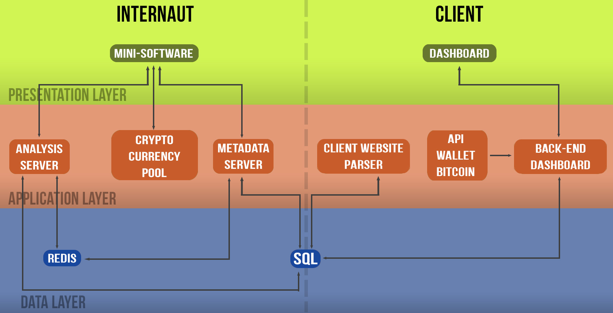

# Antmine - Technical documentation

## Architecture   

## Git repository
The project is separated into X repositories:
- [mini software](https://github.com/antmine/mini-logiciel)
- [bitcoin miner](https://github.com/antmine/bitcoin-miner)
- [metadata server](https://github.com/antmine/metadata-server)
- [analysis server](https://github.com/antmine/analysis-server)
- [database](https://github.com/antmine/database)
- [dashboard-backend](https://github.com/antmine/dashboard-backend)
- [dashboard-frontend](https://github.com/antmine/dashboard-frontend)
- [Client Website Parser](https://github.com/antmine/client-website-parser) or CWP.

### Mini software
This software is developed in JavaScript. It's load by an iframe into the viewer's computer. Its job is to get information about viewer's computer and send it to the [analysis server](#the-analysis-server). When the server return the cryptocurrency algorithm, it must run it.  
This is the list of required features:
 - Get internaut's informations  
        - Battery status (online or not)  
        - Computing power  
        - Information about his browser  
        - Is the current tab (or not)  
        - graphic card's information

### Bitcoin miner
The bitcoin miner is the "algorithm" sent by the [analysis server](#the-analysis-server) and run by the [mini software](#the-mini-software).

### Metadata server
This server is used as the a huge logger. It's write on python. Every events or actions must be logged on the SQL database throw this server.  
    
### Analysis server
This server is writed on swift. Its job is to select the best cryptocurrency based on the internaut's information.  

This is the list of required features:  
   - Receive information from client  
   - Save the choice into [Redis](redis.io)  
   - Analyse the data sent by the [mini-logciel](#the-mini-software)  
   - Return the algorithm of the selected money to the client.
   - Checks the client ID and rigths
   - Log into SQL all errors  
### Database
The repository contains the architecture's file of the SQL database.

### Dasboard
This is the website used by client to manage his solution. He can:
- add/remove website
- analysis statistics about his website(s).
- get back bictoins he earned.

#### Dashboard backend
This is the API of this dashboard.

#### Dashboard frontend
This the the interface of this dashboard.

### CWP - Client Website Parser

## Contact
For any problems : contact@antmine.io
